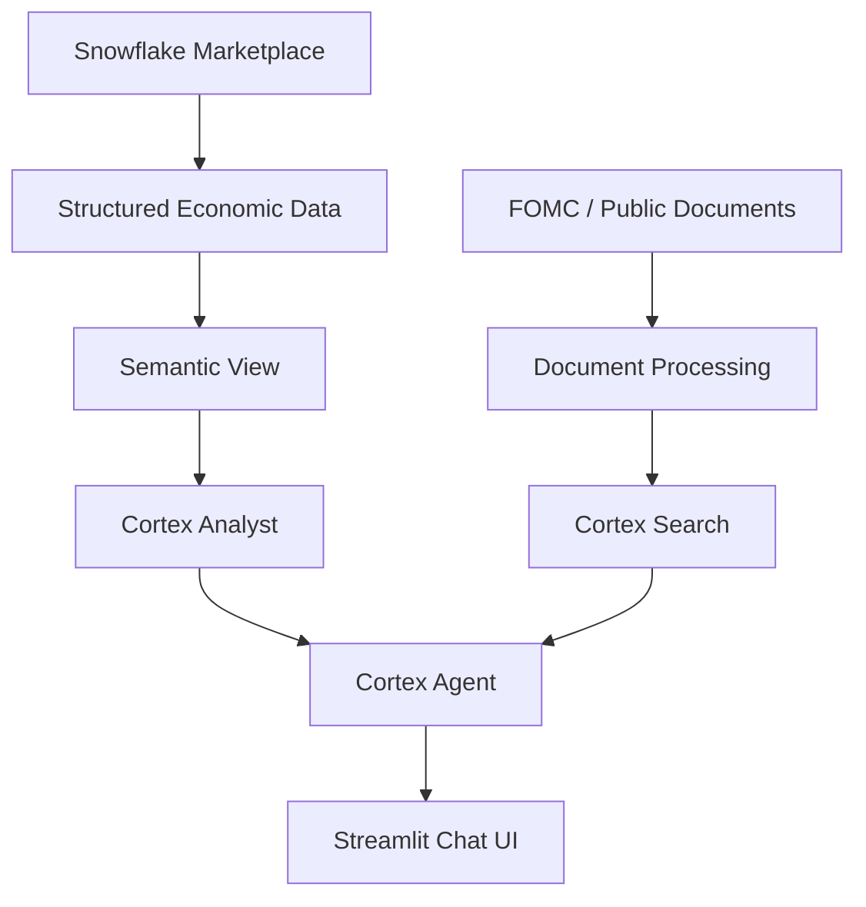

# Architecture

This document describes the target architecture for the project. It is not the current implementation.

## Target Architecture

## Concept

Structured economic data will support semantic analysis through Cortex Analyst. Public economic documents will support retrieval through document processing and Cortex Search. A future Cortex Agent will combine both paths and expose the experience through a Streamlit chat UI.

No Snowflake objects, application code, agents, semantic views, or search services are implemented in this phase.
